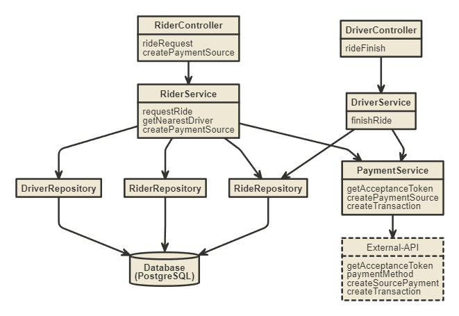
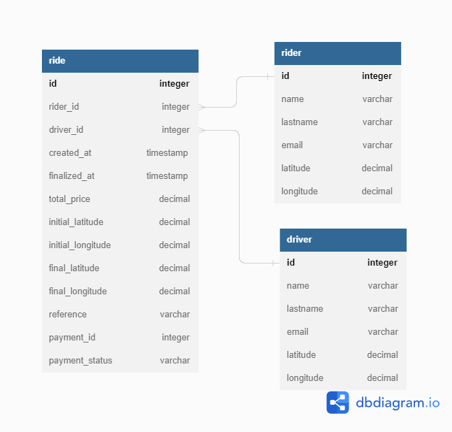

# trips-api

trips-api is an exceptional project developed with NestJS, TypeScript, PostgreSQL, Docker, GitHubActions and AWS. As a Rider you can request a Ride everywhere, and the API will contact the nearest driver to assist you in your trip.In order to use the service you must register a payment method beforehand (Credit Card for example), and finally the API will perform the necessary steps to finalize the ride and make a transaction. You can access the deployed API documentation at the following URL: http://ec2-3-128-30-79.us-east-2.compute.amazonaws.com:3000/api 

## How to Run?

### Instructions to run the project locally (Dev environment):
1. Start the database by running the following Docker command:
```
docker run --name trips-database -p 5432:5432 -e POSTGRES_DB=trips_db -e POSTGRES_USER=trips_user -e POSTGRES_PASSWORD=123456 -d postgres:11
```
2. Copy the .env.example file and rename it to .env.
3. Fill in the necessary information in the .env file:
```
DATABASE_HOST=127.0.0.1
DATABASE_PORT=5432
DATABASE_USERNAME=trips_user
DATABASE_PASSWORD=123456
DATABASE_NAME=trips_db
```
4. Install the project dependencies by running:
```
npm install
```
5. To execute the migrations, run the following command:
```
npm run migration:run
```
6. To run the project, use the following command:
```
npm run start:dev
```
7. You can access the API documentation in your browser at the following URL:
```
http://localhost:3000/api
```


## Architecture
Trips-api has a 3-layer architecture: Controllers, Services, and Repositories. Each layer has a unique responsibility, the architecture follows the best practices and maintain code quality. The Controllers handle incoming requests and interact with the Services, which contain the business logic of the application. The Services, in turn, interact with the Repositories, which manage the persistence of our data. By following this architecture, it was able to write maintainable and modular code that adheres to good programming practices.



## Database

The database used to store and manage the data is PostgreSQL, in order to create and execute the migrations TypeORM was implemented. The Entity Relation Diagram illustrates the various entities in the system and how they are related to each other:



## Testing

Unit testing was made using Jest in DriverService and RiderService of the project , they are in service folder.

## Libraries

The following libraries are utilized in the project:

- TypeORM: provides data persistence and migrations.
- class-validator: performs server-side validations.
- uuid: generates unique references for the transactions.
- HttpModule (axios): facilitates communication with the external API.
- Jest: to do testing.


## Docker

La imagen de Docker esta realizada de la siguiente manera:
Se intala Docker.

En un contenedor tenemos la Base de datos de Postgres en el puerto 5432, en otro contenedor tenemos la trip-api.


## CI/CD
This application has a CI/CD process through GitHub Actions. For every push made to the master branch, the code is compiled, test are executed, a Docker image is created, published to Docker Hub, and a container that is in EC2 is restarted. You can access the deployed API documentation at the following URL:

Cómo esta construida la EC2


# AWS - EC2
Usando el servicio de AWS EC2 instalamos Docker en el sistema.
Dentro de Docker creamos dos contenedores: uno para alojar la imagen de trips-api y otro para la imagen de la base de datos de postgresql. 
